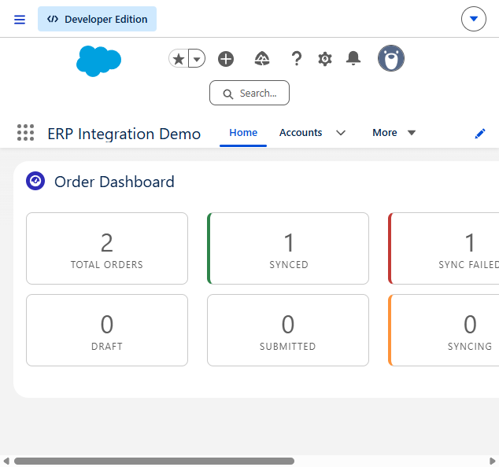
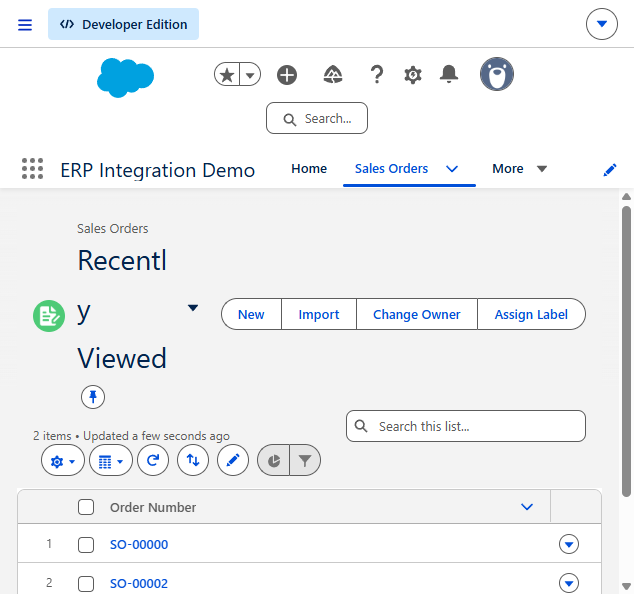
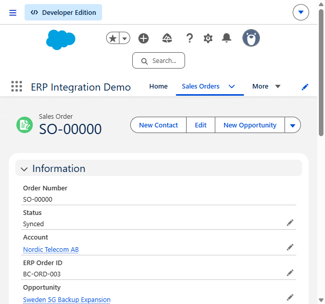
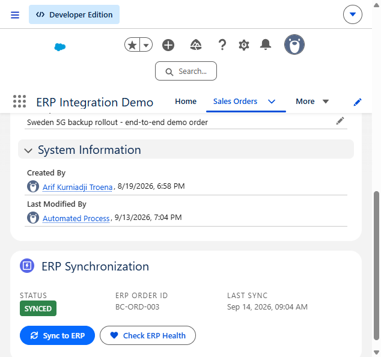
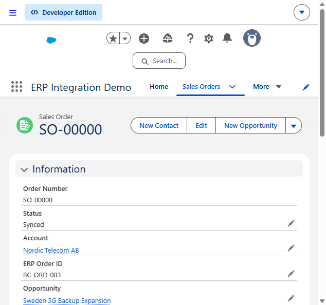
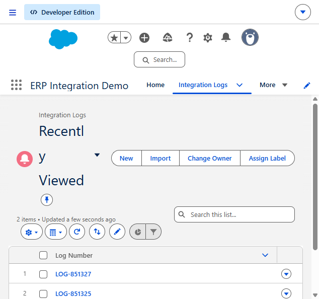
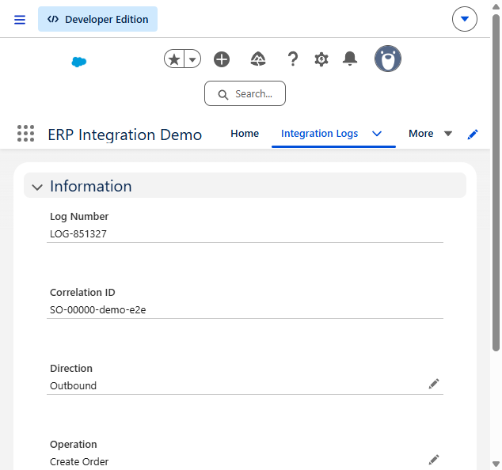
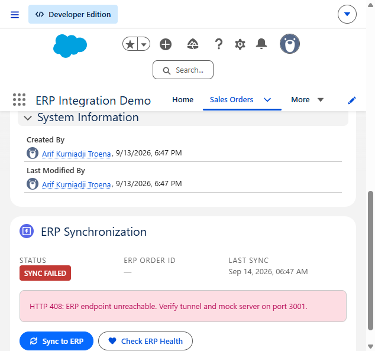
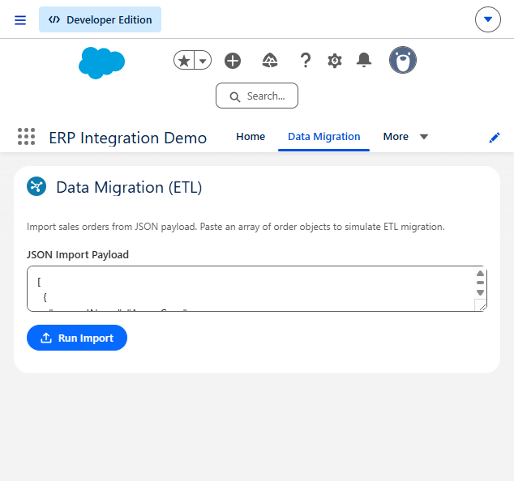

# Salesforce ERP Integration

Salesforce integration with Microsoft Dynamics 365 Business Central: Apex service layer, LWC UI, Platform Event-driven async sync, REST APIs, ETL data migration, and CI/CD deployment pipeline.

> **Sales Cloud & Service Cloud** — The implementation connects standard Account, Opportunity, Product, Asset, Case, Contact, and Task records to a dedicated `Sales_Order__c` ERP boundary. See [docs/REAL_CASE_ARCHITECTURE.md](docs/REAL_CASE_ARCHITECTURE.md) and [docs/SALES_SERVICE_CLOUD.md](docs/SALES_SERVICE_CLOUD.md).

## Business Scenario

A global energy-storage company uses Salesforce as CRM and Microsoft Dynamics 365 Business Central as ERP. Closing an Opportunity creates one traceable draft Sales Order. Submitted orders sync asynchronously to ERP with idempotency, retry, bidirectional status updates, and audit logging. Service agents manage installed battery Assets and warranty Cases from the same customer record.

## Architecture

```
┌─────────────────────┐     Platform Event      ┌──────────────────┐
│  Sales_Order__c     │ ──────────────────────► │ OrderSyncQueueable│
│  (Trigger/Flow)     │                         │  (Async Callout)  │
└─────────┬───────────┘                         └────────┬─────────┘
          │                                              │
          │ LWC Manual Sync                              │ REST API
          ▼                                              ▼
┌─────────────────────┐     Status Callback     ┌──────────────────┐
│ erpOrderSyncPanel   │ ◄────────────────────── │ Mock ERP Server  │
│ (Lightning)         │                         │ (localhost:3001) │
└─────────────────────┘                         └──────────────────┘
          │
          ▼
┌─────────────────────┐
│ Integration_Log__c  │  ← Audit trail for all API calls
└─────────────────────┘
```

## Capabilities

| Area | Implementation |
|---|---|
| Apex, LWC, SOQL, Flow | Service layer, 4 LWCs, Platform Events, and three record-triggered Flows |
| Administration & Security | Permission Sets, FLS, `with sharing`, `WITH SECURITY_ENFORCED`, inbound REST auth |
| ERP Integration (D365 BC) | REST API callouts mimicking BC OData v2.0 |
| Event-driven / Async | Platform Events + Queueable + Batch |
| Data Migration / ETL | `DataMigrationService` + CSV/JSON samples + LWC import tool |
| DevOps / CI-CD | GitHub Actions pipeline, deploy scripts (PowerShell + Bash) |
| REST APIs | Inbound `@RestResource` with Bearer auth + outbound HTTP callouts |
| Reports & Dashboards | `orderDashboard` LWC with aggregate SOQL; native Reports enabled on objects |
| Sales / Service Cloud | Closed Won order automation, Account Customer 360, installed Assets, warranty Case triage, and Tasks |
| Documentation | README, [REAL_CASE_ARCHITECTURE.md](docs/REAL_CASE_ARCHITECTURE.md), [DESIGN_DECISIONS.md](docs/DESIGN_DECISIONS.md), [REQUIREMENTS_SOLUTION_MAP.md](docs/REQUIREMENTS_SOLUTION_MAP.md) |

## Implementation notes

- **One Trigger Per Object** with `TriggerHandler` framework
- **Service layer** — business logic separated from triggers/UI
- **Custom Metadata** for integration configuration (deployable, testable)
- **Platform Events** for async sync (decoupled from trigger transaction)
- **Apex tests** with `HttpCalloutMock`
- **Bulkification** in triggers, batch, and queueable
- **Security**: `with sharing`, Permission Sets, FLS enforcement
- **Error handling & audit logging** on every integration call
- **Idempotency** with unique correlation and external IDs across CRM and ERP
- **Callout-safe bulk processing** with deferred batch DML and Queueable chaining
- **Flow fault paths** that create actionable follow-up Tasks
- **Inbound REST authentication** — Bearer token validated against Custom Metadata API key
- **Named Credential support** — Optional outbound callouts via `callout:ERP_Integration`

## Prerequisites

| Tool | Version | Install |
|---|---|---|
| Node.js | 18+ | https://nodejs.org |
| Salesforce CLI | Latest | `npm install -g @salesforce/cli` |
| Dev Hub | Enabled | Setup → Dev Hub in your Salesforce org |

## Quick Start (Local)

### Step 1: Start Mock ERP Server

```powershell
cd mock-erp
npm install
npm start
```

Server runs at `http://localhost:3001`. API Key: `demo-api-key-local-dev`

### Step 2: Create Scratch Org & Deploy

```powershell
# Authenticate Dev Hub (one-time)
sf org login web --set-default-dev-hub --alias DevHub

# Create scratch org
sf org create scratch --definition-file config/project-scratch-def.json --alias erp-demo --set-default --duration-days 7

# Deploy all metadata
sf project deploy start --source-dir force-app --wait 10

# Assign permission set
sf org assign permset --name ERP_Integration_Developer

# Open org
sf org open
```

### Step 3: Configure & Test

1. Open app **ERP Integration Demo**.
2. Load the minimal business scenario:

```powershell
sf apex run --target-org DevHub --file scripts/setup-real-case-data.apex
```

3. Open **Nordic Telecom AB** and review Customer 360.
4. Open **Sweden 5G Backup Expansion** and its generated draft Sales Order.
5. Change the order to `Submitted`; then inspect the ERP Order ID and Integration Log.
6. Open the installed Asset and **Battery module temperature warning** warranty Case.

### Step 4: Run Tests

```powershell
sf apex run test --code-coverage --result-format human --wait 10
```

## Project Structure

```
salesforce/
├── force-app/main/default/
│   ├── classes/          # Apex services, handlers, tests
│   ├── lwc/              # Lightning Web Components
│   ├── objects/          # Custom objects & Platform Events
│   ├── triggers/         # One trigger per object
│   ├── permissionsets/   # Security model
│   ├── customMetadata/   # ERP integration settings
│   └── remoteSiteSettings/
├── mock-erp/             # Local Dynamics 365 BC mock server
├── scripts/              # Deploy & data migration scripts
├── config/               # Scratch org definition
└── .github/workflows/    # CI/CD pipeline
```

## Key Components

### Apex Classes

| Class | Purpose |
|---|---|
| `SalesOrderService` | Domain logic, validation, @AuraEnabled methods |
| `ERPIntegrationService` | Outbound REST callouts to ERP |
| `IntegrationLogService` | Centralized audit logging |
| `OrderSyncQueueable` | Async event-driven sync with retry |
| `OrderSyncBatch` | Bulk sync for data migration |
| `OrderSyncRestResource` | Inbound REST API for ERP callbacks |
| `DataMigrationService` | ETL import from JSON |
| `OpportunityOrderService` | Idempotent Closed Won Opportunity conversion |
| `WarrantyCaseService` | Warranty triage and duplicate-safe Task creation |
| `Customer360Controller` | Secure Account Sales and Service summary |
| `TriggerHandler` | Reusable trigger framework |

### LWC Components

| Component | Purpose |
|---|---|
| `erpOrderSyncPanel` | Record page sync controls |
| `orderDashboard` | Home page order statistics |
| `dataMigrationTool` | ETL import interface |
| `customer360Summary` | Account-level sales, asset, case, and integration KPIs |

## API Endpoints

### Outbound (Salesforce → ERP)

| Method | Endpoint | Description |
|---|---|---|
| POST | `/api/v2.0/salesOrders` | Create order in ERP |
| PATCH | `/api/v2.0/salesOrders({id})` | Update order |
| POST | `/api/v2.0/salesOrders({id})/cancel` | Cancel order |
| GET | `/api/v2.0/health` | Health check |

### Inbound (ERP → Salesforce)

| Method | Endpoint | Description |
|---|---|---|
| POST | `/services/apexrest/erp/v1/orders/{id}` | Status callback |
| GET | `/services/apexrest/erp/v1/orders/health` | Health check |

## Design Decisions

Key architecture choices and their rationale are documented in [docs/DESIGN_DECISIONS.md](docs/DESIGN_DECISIONS.md), including:

- Why Platform Events instead of synchronous callouts
- Why Custom Metadata for ERP configuration
- Service layer and TriggerHandler patterns
- Permission Sets, audit logging, and release pipeline

## Screenshots

### App Home



### Sales Orders — List View



### Sales Order — Synced with ERP Synchronization panel



### Sync to ERP — success notification



### ERP Health Check



### Integration Logs — List View



### Integration Log — Detail (audit trail)



### Order Dashboard — Home page


### Sales Order — Sync Failed (error handling)



### Data Migration Tool (ETL)



## Production Considerations

For a real deployment, replace:
- Custom Metadata API keys → **Named Credentials** + **External Credentials**
- `localhost` Remote Site → actual BC tenant URL
- Mock server → Azure Logic Apps / MuleSoft / direct BC OData API
- Add **Shield Platform Encryption** for sensitive fields
- Implement **Change Data Capture** for real-time ERP updates

## License

MIT
